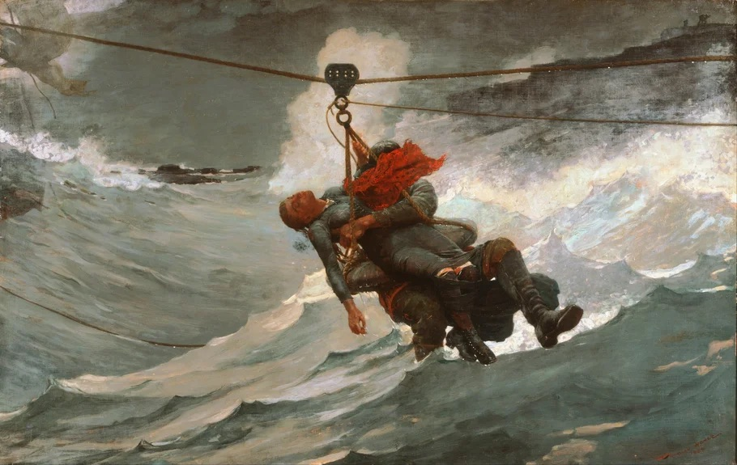

# Literature as Moral Philosophy
#### Fall 2026 
##### Led by Ethan Woelbern and advised by Jim Donelan

## Course Introduction

The focus of this course will be to explore how reading literature philosophically and reading philosophy literarily shapes our visions of a moral life. Putting this in the form of a guiding question: how does being in a dialogue with a text reveal what we, as readers, find important, truthful, and meaningful (as well as the inverse)? Navigating this question will also require recognizing how we may fail to acknowledge certain aspects of a text while reading it. 

The philosopher Stanley Cavell states in the beginning of his work *The Claim of Reason* that he seeks to read philosophy as a series of texts. Cavell ends the book by asking if one can think about the characters in "Othello" as philosophers. Using these quote as guiding principles, I would like to see a) how reading philosophy outside of the realm of argument shifts the focus of the practice altogether and b) look at the ways that reading literary and philosophical texts can help us understanding ourselves and our world. 

Class will be structured with both a lecture and a seminar, the first 15 minutes spent on the former and the last hour spent on the latter. Attendance is encouraged, and if attending, having done the reading will be mandatory. Please print the readings or pick up the print copies I will make. No laptops in class, ipads are fine. I will set up an email group for encouraged (but not mandatory) weekly reflections. A final paper will be optional. 
 

## Week 1, September 28th: Why Literature

##### Readings

+ [Iris Murdoch: “Vision and Choice in Morality” in *Existentialists and Mystics* 76-98](Existentialists-and-mystics.pdf)
+ [Cora Diamond: “Anything but Argument” in The Realistic Spirit 291-308](diamond_1996_the_realistic_spirit_wittgenstein,_philosophy,_and_the_mind.pdf)

##### Supplementary Reading

+ [Diamond: "Having a Rough Story about What Moral Philosophy Is" in *The Realisitic Spirit* (367-382)](diamond_1996_the_realistic_spirit_wittgenstein,_philosophy,_and_the_mind.pdf)

## Week 2, October 5th: Intention and Authorship

##### Readings 

+ [Stanley Cavell: “A Matter of Meaning it” in *Must We Mean What We Say* (213-237)](Must-We-Mean-What-We-Say.pdf)
+ [Elizabeth Anscombe: *Intention*: (§4-6)](Intention.pdf)

## Week 3, October 12th: The Groundlessness of Moral Judgements

##### Readings

+ [Cavell: “Asthethic Problems of Modern Philosophy” in *Must We Mean What We Say* (68-90)](Must-We-Mean-What-We-Say.pdf)
+ [Diamond: “The Difficulty of Reality” in *Reading Cavell* (98-118)](2006-reading-cavell.pdf)

##### Supplementary Reading

+ [Cavell: Title Essay in *Must We Mean What We Say* (1-40)](Must-We-Mean-What-We-Say.pdf)

## Week 4, October 19th: The Difficulty of Reality

##### Readings

+ [J.M. Cotzee: *The Life and Times of Michael K*](<Life and times of Michael K -- J_M_ Coetzee -- 1983 -- The Viking Press -- isbn13 9780965528955 -- a60ec8bd86aaf9174d0abc5d298db58d -- Anna’s Archive.pdf>)

## Week 5, October 26th: The Difficulty of Reality

##### Readings:

+ Finish *The Life and Times of Michael K*
+ [Simone Weil: *Human Personality*](human-personality.pdf)

## Week 6, November 2nd: Reading Ourselves

##### Readings

+ [Ludwig Wittgenstein: *Philosophical Investigations* (§1-32)](wittgenstein_1968_philosophical_investigations.pdf)

## Week 7, November 9th: Reading Ourselves

##### Readings

+ Continue reading *Philosophical Investigations*
+ [Stanley Cavell: "The Availibility of Wittgenstein's Later Philosophy" in *Must We Mean What We Say* (44-72)](Must-We-Mean-What-We-Say.pdf)

## Week 8, November 16th: Acknowledging Others

##### Readings

+ Blade Runner (Can be found on Kanopy through the Santa Barbara Library or HBO MAX)
+ [Cavell: *The Claim of Reason* (1-15,476-496)](Claim-of-Reason.pdf)

##### Supplementary Readings

+ [Andrew Norris: Self and Other in Blade Runner](norris-2017-how-can-it-not-know-what-it-is-self-and-other-in-ridley-scott-s-blade-runner.pdf)

## Week 9, November 23rd: Ordinary Ethics

##### Readings 

+ [Henrik Ibsen: "A Doll's House"](<A Doll's House- A Play -- Henrik Ibsen -- 2020 -- https---onemorelibrary_com -- 63faf38a7dfaba0d9cb1a9d2a987aef1 -- Anna’s Archive.pdf>)

## Week 10, November 30th: Ordinary Ethics

##### Readings

+ Finish Ibsen's "A Dolls House"

